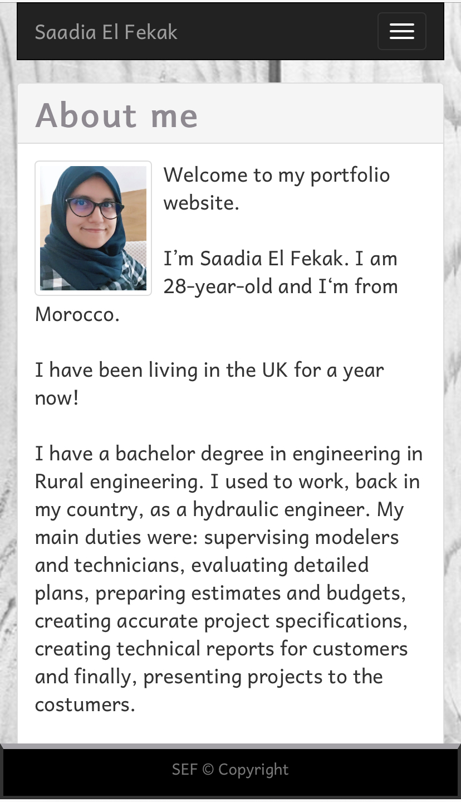
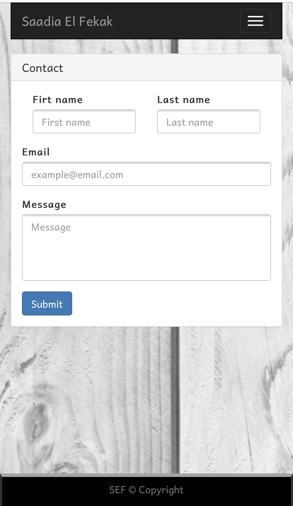

#Responsive_Portfolio_SEF

-----------------------------------------------------------------------------------------------------------------------
Table of content :

1. The purpose
2. The methods
3. HTML files
4. Bootsrap framework
5. CSS file
6. Screenshots
7. URLs 

-----------------------------------------------------------------------------------------------------------------------

## 1. The purpose :

The main purpose of this project is to create a responsive portfolio website using Bootsrap.

-----------------------------------------------------------------------------------------------------------------------

## 2. The method : 

    This website is created using the following languages and software.

    * HTML files : index.html, contact.html and portfolio.html.
    * CSS file : style.css
    * Bootsrap CSS framework
    * VS Code
    * Github
    * Google fonts

-----------------------------------------------------------------------------------------------------------------------

## 3. HTML files : 
    
    This files are created according to the standards.

    * Using sementics <header> , <nav> , <main> , <section> and <footer>
    * Using consistently indentation and spacing
    * Validating the HTML files in a validator
    * Using links to link the HTML file to other files and frameworks
    * Commenting the code

-----------------------------------------------------------------------------------------------------------------------

## 4. Bootsrap framework : 

This open-source framework is used to style the website and make it reponsive. 

    The main Bootsrap components used in this website are :

    * Grid-system : container, rows and columns (.container, .row, .col)
    * Responsive grid: .col-xs .col-md
    * Navigation bar : .navbar
    * Panels : .panel
    * Image thumbnail : .img-thumbnail 
    * Form : .form-group, .form-row
    * Button : .btn

-----------------------------------------------------------------------------------------------------------------------

## 5. CSS file : 

This file is used to personalise the styles by creating new classes and id.

    The main CSS properties used in this website are :
    
    * Font : font-size, font-family, font-weight
    * Margin : margin-top, margin-left, margin-bottom, margin-right
    * Border : border-top, border-top-width, border-style
    * Position
    * Height
    * Width
    * Bottom
    * color : color, background-color

-----------------------------------------------------------------------------------------------------------------------

## 6. Screenshots :

    * Mobile size screen screenshots : 

    

    * Laptop size screen screenshots : 
    

    

-----------------------------------------------------------------------------------------------------------------------

## 7. URLs

* The URL of the deployed application : https://saadiaelf.github.io/Responsive_Portfolio_SEF/

* The URL of the GitHub repository: https://github.com/SaadiaELF/Responsive_Portfolio_SEF.git

-----------------------------------------------------------------------------------------------------------------------
